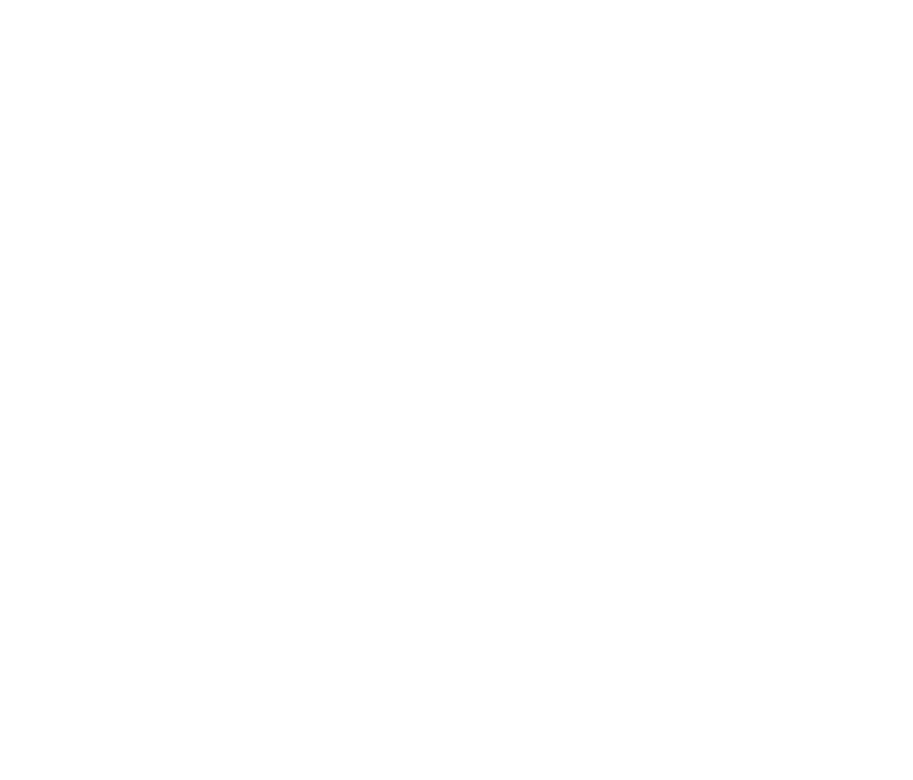
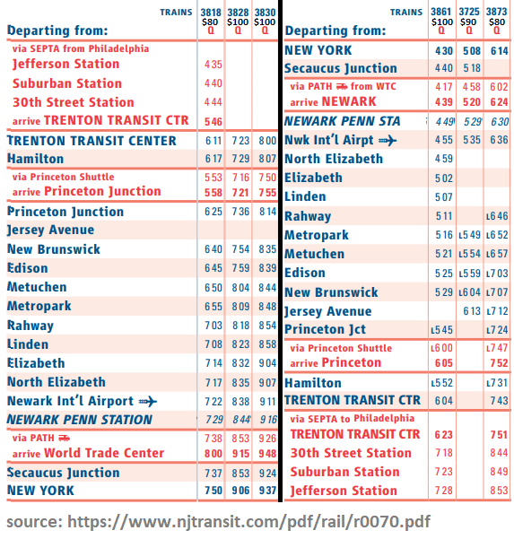

# Train Reservation System

## Overview

This project is a Train Reservation System that allows customers to make reservations for train journeys, employees to manage customer queries, and managers to oversee operations. The system is built using Java and SQL.

### Entity Relation Diagram (ERD)
<p align="center">
    <picture>
      <source media="(prefers-color-scheme: light)" srcset="assets/er_diagram-v3_light.png">
      <source media="(prefers-color-scheme: dark)" srcset="assets/er_diagram-v3_dark.png">
      
    </picture>
</p>

**Note**: While "Questions" and "Answers" could be combined into one entity because of their current one-to-one relationship, we've kept them separate to match our existing codebase. This separation makes the system easier to maintain and also allows for future flexibility, like adding multiple answers or replies to a single question (provided the cardinality constraint for "Questions" to "Reply" is updated). However, if a future refactor is considered, merging them could simplify the design by removing the "Reply" relationship and directly combining the entities.

## Functionality

All functionality from the checklist has been implemented.

#### I. **Account functionality**  
- Register customers  
- Login (for all customers, admin, customer reps)  
- Logout (for all customers, admin, customer reps)  

#### II. **Browsing and search functionality**  
- Search for train schedules by origin, destination, date of travel   
- Browse the resulting schedules   
  - See all the stops a train will make, fare, etc.  
- Sort by different criteria (by arrival time, departure time, fare)   

#### III. **Reservations**  
- A customer should be able to make a reservation for a specific route (round-trip/one way)   
- Get a discount in case of child/senior/disabled   
- Cancel existing reservation   
- View current and past reservations with their details (separately)   

#### IV. **Admin functions**  
- Admin (create an admin account ahead of time)  
  - Add, edit, and delete information for a customer representative   
  - Obtain sales reports per month   
  - Produce a list of reservations:   
    - By transit line  
    - By customer name  
  - Produce a listing of revenue per:   
    - Transit line  
    - Customer name  
- Best customer   
- Best 5 most active transit lines   

#### V. **Customer representative**  
- Edit and delete information for train schedules   
- Customers browse questions and answers   
- Customers search questions by keywords   
- Customers send a question to customer service   
  - Reps reply to customer questions   
- Produce a list of train schedules for a given station (as origin/destination)   
- Produce a list of all customers who have reservations on a given transit line and date   


## File Structure

```
.
├── assets
│   ├── er_diagram-v3_dark.png
│   ├── er_diagram-v3_light.png
│   └── mock_transit.png
├── src
│   └── main
│       └── java
│           ├── com
│           │   └── cs336
│           │       └── pkg
│           │           ├── DateTimeConversion.java
│           │           ├── LineSchedule.java
│           │           ├── Reservation.java
│           │           ├── Station.java
│           │           └── ApplicationDB.java
│           └── webapp
│               ├── Customer
│               │   ├── askQuestion.jsp
│               │   ├── cancelReservation.jsp
│               │   ├── confirmReservation.jsp
│               │   ├── customerWelcome.jsp
│               │   ├── placeReservation
│               │   └── viewSchedules.jsp
│               ├── Manager
│               │   ├── addEmployee.jsp
│               │   ├── deleteEmployee.jsp
│               │   ├── editEmployee.jsp
│               │   ├── getReservations.jsp
│               │   ├── getRevenue.jsp
│               │   ├── getSalesReport.jsp
│               │   ├── managerWelcome.jsp
│               │   └── updateEmployee.jsp
│               ├── Representative
│               │   ├── deleteSchedule.jsp
│               │   ├── repWelcome.jsp
│               │   ├── updateSchedule.jsp
│               │   └── viewStops.jsp
│               ├── 403.jsp
│               ├── login.jsp
│               │── logout.jsp
│               └── register.jsp
├── tests
│   ├── sql
│   │   ├── Dump20241209.sql
│   │   ├── table_data.sql
│   │   └── schema.sql
│   └──  buildMockTransit.py
└── README.md
```

- `assets/mock_transit.png`: Visual representation of NJ Transit lines, used as a reference for generating mock transit data.
  - 
- `src/main/java/com/cs336/pkg/ApplicationDB.java`: Java class for database connection management.
- `tests/sql/Dump20241209.sql`: Complete SQL dump file containing the database schema and mock data for initializing the database.
- `tests/sql/table_data.sql`: SQL script for inserting mock data into all tables.
- `tests/sql/schema.sql`: SQL script for creating the database schema.
- `tests/buildMockTransit.py`: Builds `./sql/table_data.sql` with appropriate data.


### Testing Credentials

You can view the credentials for different roles in `table_data.sql`. Below are sample credentials for each role to start with:

- **Manager**: 
  - Username: `mgr1`
  - Password: `mgr1`
- **Employee**: 
  - Username: `emp1`
  - Password: `emp1`
- **Customer**: 
  - Username: `aliceg`
  - Password: `securepass1`

## How to Test

1. **Set Up the Database**:
    - Ensure MySQL is installed and running on your machine.
    - Create the database and tables by running the respective scripts or using the command line.
    - Make sure JDBC is installed and configured on your machine.

2. **Configure Database Connection**:
    - Update the `DB_USER` and `DB_PASSWORD` in `ApplicationDB.java` with your MySQL credentials.

3. **Ensure Tomcat 9 Configuration**:
    - Ensure Tomcat 9 is installed and configured on your machine.
    - Follow the sample project in the course files.

3. **Compile and Run the Application**.

By following these steps, you can set up, configure, and test the Train Reservation System.